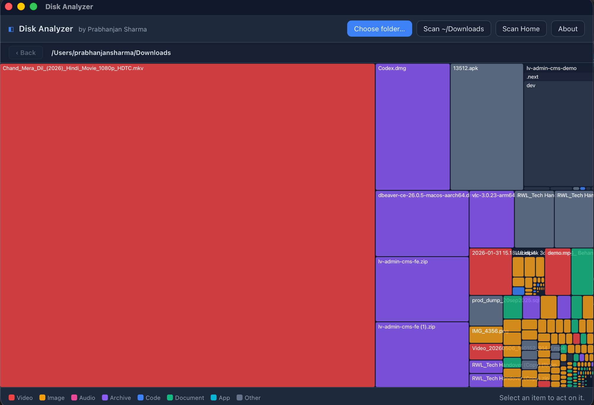

# 🧭 Disk Analyzer

A fast, native **macOS disk-usage visualizer** built with [Tauri](https://tauri.app/) (Rust) and React. Point it at a folder and it lays out every file and directory as a **treemap** — each rectangle's area is its size on disk, color-coded by file type — so you can find what's eating your drive in seconds and safely send the space-hogs to the Trash.



## ✨ Features

- **Parallel scan** — the filesystem is walked in parallel (Rust + rayon) on a background thread, so the UI never freezes.
- **Bounded memory** — the size tree is depth/size/breadth-capped so even scanning your whole Home directory won't blow up memory; deeper folders are re-scanned on demand when you zoom in.
- **Treemap visualization** — area = size on disk, colored by category (Video, Image, Audio, Archive, Code, Document, App, Other).
- **Drill down & back** — double-click a folder to zoom in, use the **‹ Back** button or `Esc` / `Backspace` to go back up, and the breadcrumb to jump anywhere.
- **Act on files** — select any item to **Reveal in Finder** or **Move to Trash** (recoverable), with the freed space reported.
- **Universal build** — runs natively on both Apple Silicon and Intel Macs.

## 📦 Install

Download the latest `.dmg` from the [**Releases page**](https://github.com/prab002/disk-analyzer/releases), open it, and drag **Disk Analyzer** into Applications.

> [!IMPORTANT]
> The app is **not notarized** by Apple (that needs a paid Developer account), so macOS Gatekeeper blocks it on first open with a *"Apple could not verify… is free of malware"* warning. This is expected for an open-source indie app — pick whichever unblock works for your macOS version:
>
> **Option A — Terminal (works on every macOS version, recommended):**
> ```bash
> xattr -cr /Applications/disk-analyzer.app
> ```
> Then open the app normally. (If you haven't moved it to Applications yet, use the path where the `.app` actually is, e.g. `~/Downloads/disk-analyzer.app`.)
>
> **Option B — System Settings (macOS Ventura/Sonoma/Sequoia):**
> Try to open the app once (it gets blocked), then go to **System Settings → Privacy & Security**, scroll down, and click **"Open Anyway"**.
>
> **Option C — older macOS (Monterey and earlier):** right-click the app → **Open** → **Open**.
> _(Note: on macOS Sequoia 15 this right-click trick no longer works — use Option A or B.)_

## 🛠️ Development

Requirements: [Rust](https://rustup.rs/), [Node.js](https://nodejs.org/), and [pnpm](https://pnpm.io/).

```bash
pnpm install          # install frontend deps
pnpm tauri dev        # run the app in dev mode (hot reload)
```

### Build a release bundle

```bash
# universal (Apple Silicon + Intel) — produces a .dmg
rustup target add aarch64-apple-darwin x86_64-apple-darwin
pnpm tauri build --target universal-apple-darwin
```

Output lands in `src-tauri/target/universal-apple-darwin/release/bundle/`.

## 🚀 Releasing (CI)

Releases are automated via GitHub Actions ([`.github/workflows/release.yml`](.github/workflows/release.yml)). Pushing a version tag builds the universal DMG and publishes it to GitHub Releases:

```bash
# bump "version" in package.json AND src-tauri/tauri.conf.json, then:
git commit -am "release: v0.2.0"
git tag v0.2.0
git push origin main --tags
```

## 🧩 Tech stack

| Layer    | Tech                                   |
| -------- | -------------------------------------- |
| Shell    | Tauri 2 (Rust)                         |
| Scanning | `rayon` parallel walk, `trash` crate   |
| UI       | React 19 + Vite + TypeScript           |
| Treemap  | `d3-hierarchy`                         |

## 🤝 Contributing

Open source — issues and pull requests are welcome. Open the repo at
[github.com/prab002/disk-analyzer](https://github.com/prab002/disk-analyzer).

## 👤 Owner

**Prabhanjan Sharma**
[GitHub](https://github.com/prab002) · [LinkedIn](https://www.linkedin.com/in/prab-sharma/)

## 📄 License

Released under the [MIT License](LICENSE) © 2026 Prabhanjan Sharma.
